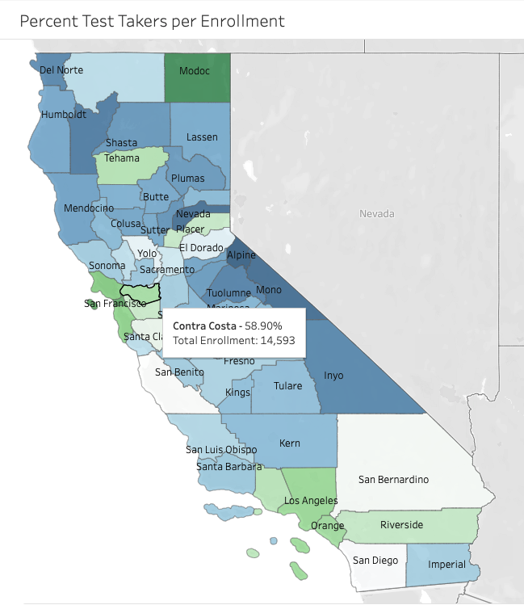

#  Project 1: Standardized Test Analysis

## Contents:
- [Background](#Background)
- [Problem Statement](#Problem-Statement)
- [Data Dictionary](#Data-Dictionary)
- [Executive Summary](#Executive-Summary)
- [Conclusions & Recommendations](#Conclusions-and-Recommendations)

## Background
For a state as geographically and demographically diverse as California, there really is no one-size-fits-all solution to any problem, much less education. And before analyzing the level of college-readiness among high-school seniors at the county level, it’s important to understand the population distribution across the state. The overwhelming majority of residents live in suburbs of either Los Angeles, San Diego, or San Francisco. These mega-cities have a total population of 9.8 million, 3.1 million, and 1 million respectively. On the other side of the state, sparsely populated counties in northern California have maybe 5,000-15,000 constituents each. Due to this significant disparity among rural and urban communities, I relied more heavily on percentages of county totals, rather than the actual number of test-takers.

On a similar note, the ACT and SAT tests are graded on different scales. The SAT consists of a Reading/Writing and a Math section on a scale of 200 – 800 each. The Total score is calculated by adding both sections for a range of 400-1600. ([*collegeboard.org*](https://collegereadiness.collegeboard.org/sat/scores/understanding-scores/structure)) The ACT contains four subjects (Math, Reading, English, and Science) on a scale of 1-36 each. The composite score is calculated as an average of each subject, also from 1-36. ([*act.org*](https://www.act.org/content/act/en/products-and-services/the-act/scores/understanding-your-scores.html)) For this reason, I decided to use national benchmarks as a pass/fail indicator to be able to compare student performance on both tests. The national benchmark for the SAT is a 480 Verbal/530 Math, for a total score of 1,010. ([*collegeboard.org*](https://collegereadiness.collegeboard.org/about/scores/benchmarks)) On the ACT, the national average for a composite score is 21. ([*princetonreview.com*](https://www.princetonreview.com/college-advice/good-act-scores))
 

## Problem Statement
The primary goal of this project is to help the State of California identify which counties need additional assistance with SAT/ACT test prep materials in order to prepare the highest percent of students possible for college entrance exams.
- A secondary analysis seeks to determine which of the two tests is more popular, and how likely students are to achieve a national benchmark on either the ACT or the SAT.
- Lastly, this study evaluates the subjects themselves to see which counties should focus their efforts more on Math or Reading/Writing.

## Data Dictionary

This study uses datasets from the California Department of Education ([*SAT*](http://www3.cde.ca.gov/researchfiles/satactap/sat19.txt), [*ACT*](http://www3.cde.ca.gov/researchfiles/satactap/act19.txt)) and the California Department of Public Health. ([*link*](https://www.cdph.ca.gov/Programs/OHE/Pages/HCI-Search.aspx))

|Feature|Type|Description|
|---|---|---|
|**county**|*string*|One of 58 counties in the state of California| 
|**region**|*string*|A census level sub-group of counties: Bay Area, North Coast,  Central Coast, Superior, North Valley, Southern Valley,  Southern California|
|**total_pop**|*integer*|The total population of the county|
|**total_enrollment**|*integer*|The total number of students enrolled in 12th grade in the county|
|**pct_test_takers**|*float*|The percent of total enrollment to take either the SAT or ACT|
|**pct_took_SAT**|*float*|The percent of total enrollment to take the SAT only|
|**pct_took_ACT**|*float*|The percent of total enrollment to take the ACT only|
|**pct_pass_SAT_Total**|*float*|The percent of enrollment to pass the SAT national benchmark 1010|
|**pct_pass_SAT_ERW**|*float*|The percent of enrollment to pass the SAT Reading/Writing benchmark 480|
|**pct_pass_SAT_Math**|*float*|The percent of enrollment to pass the SAT Math benchmark 530|
|**pct_pass_ACT_Total**|*float*|The percent of enrollment to pass the ACT national benchmark 21|
|**avg_ACT_Reading**|*integer*|The average score on the ACT Reading test per county 1-36|
|**avg_ACT_English**|*integer*|The average score on the ACT English test per county 1-36|
|**avg_ACT_Math**|*integer*|The average score on the ACT Math test per county 1-36|

---

# Executive Summary
As can be expected, there is a positive correlation between each county's population and it's total enrollment of 12th grade students. Los Angeles county was removed as an outlier in most early statistical models as its enrollment of 114,000 students dwarfed the nearest competitor, San Diego, by over 70,000 students. In fact, there’s probably enough data to analyze the school districts in Los Angeles county alone, independent of any other county. The “Percent Test-Takers” field, which calculated the number of test-takers _relative to each county’s 12th grade enrollment_, was the most revealing metric to highlight the geographic disparities in participation in standardized testing. It was immediately apparent that the major population centers of Los Angeles, San Diego, and San Francisco had the highest percent of test-takers. However, there were a few standouts in the Northern Valley region, particularly Placer and Tehama counties. While they have significantly lower enrollment compared to other areas of the state, they both achieved over 50% participation in either the SAT or ACT among their graduating classes. These two counties can serve as a model for other rural areas in their region.  
<<[*Check out this interactive map*](https://public.tableau.com/profile/ap1616#!/vizhome/TestTakersperEnrollment/PctTestTakers)>>
 
When comparing participation rates between the SAT and ACT tests, the data showed that a plurality of students still take the SAT (around 20-40% of enrollment for most counties). Only three counties had a higher participation in the ACT, and those were Modoc, Tehama, and Trinity counties—again, rural areas in northern California’s Superior region. Interestingly though, the students that elected to take the ACT were more likely to pass a national benchmark. Across all counties, the average percent of enrollment to pass a national benchmark on the ACT was 56.8%, compared to 49.7% for the SAT. One potential theory is that with fewer test-takers, there might be less competition during the calculation of scaled scores. However, when grouped by the county level, California’s 2019 testing data showed no correlation between percent participation in testing and the overall chance of passing a national benchmark. These findings varied from those of my classmates at the national level across multiple years, which saw a negative correlation between test participation and average scores. To further explore whether or not that correlation exists in California, it might be worth disaggregating the data down to the school district level.

Finally, when the Math and Reading/Writing subject areas were examined separately, several geographic trends reappeared again. Most impressively, the Bay Area region scored highest on all subjects, in both tests. On average statewide, students also scored 20% higher on the SAT Verbal section than they did on the Math portion. And while the Southern Valley region scored lowest across all subjects in both tests, Southern California ranked a close second worst. This region includes both Los Angeles and Orange County, which have an extremely high number of enrolled students. The fact that only 36% of test-takers in Riverside County passed the national benchmark on SAT Math seems particularly low, and Los Angeles also ranked in the bottom 10 statewide for percent passed the SAT Reading/Writing benchmark.
 

## Conclusions and Recommendations
Overall, I would recommend the State of California focus on increasing participation in college entrance exams in rural areas, particularly in the Superior and Southern Valley regions. I also would encourage the state to lobby for more testing availability for the ACT, as students in less populous counties had a better chance of success on that test. And finally, while the number of students taking college entrance exams in the Southern California region is high, there were a few specific trouble areas that are worth looking into. In the end, what matters most is that the State of California targets its scarce resources to the right areas most in need as an effective means of improving the college-readiness of graduating seniors.